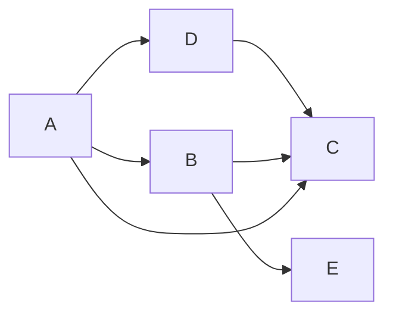

# מפת דרכים לאיתור באגים ב-Fullstack

```mermaid
graph LR
A --> D
click D https://github.com/zspitz/debuggingProcess/commit/15da69e427a4d209f180817b9bee78aaf79cc4ec
A --> B
D --> C
B --> C
A --> C
B --> E
```