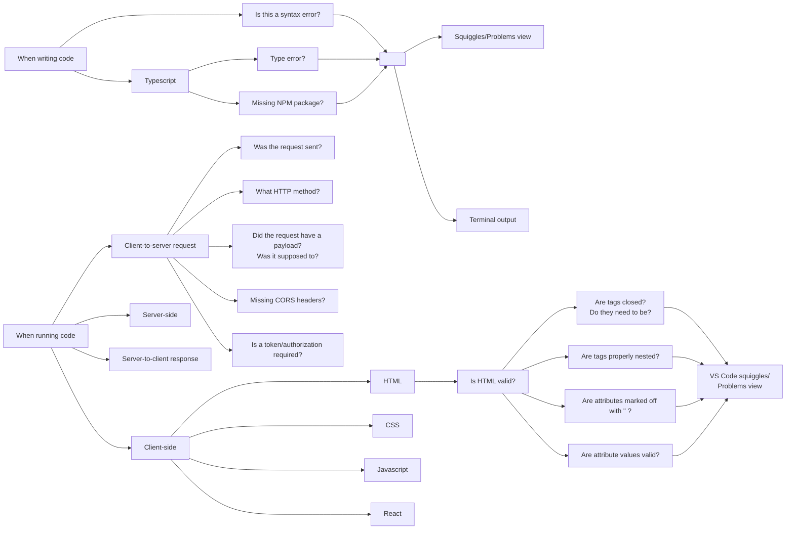

# מפת דרכים לאיתור באגים ב-Fullstack

לא ניתן לפתוח קישורים באופן ישיר, רק עם לחיצה-אמצעית, CTRL+click (או Command+click), או לחיצה-ימנית ופתיחה בטאב חדש.

```mermaid
graph LR
N000[When writing code] --> N001[Is this a syntax error?]
N000 --> N002[Typescript] --> N003[Type error?] & N004[Missing NPM package?]
N001 & N003 & N004 --> N005[ ]
N005 --> N006[Squiggles/Problems view] & N007[Terminal output]

N008[When running code] --> N009[Client-side] & N010[Client-to-server request] & N011[Server-side] & N012[Server-to-client response]
N009 ---> N019[HTML] & CSS & Javascript & React

N019 --> N020[Is HTML valid?] --> N021["`Are tags closed?
Do they need to be?`"] & N022[Are tags properly nested?] & N023[Are attributes marked off with #quot; ?] & N024[Are attribute values valid?] --> N025["`VS Code squiggles/
Problems view`"]

N010 --> N014[Was the request sent?] & N015[What HTTP method?] & N016["`Did the request have a payload?
Was it supposed to?`"] & N017[Missing CORS headers?] & N018[Is a token/authorization required?]


```