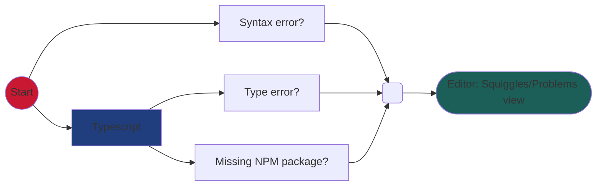
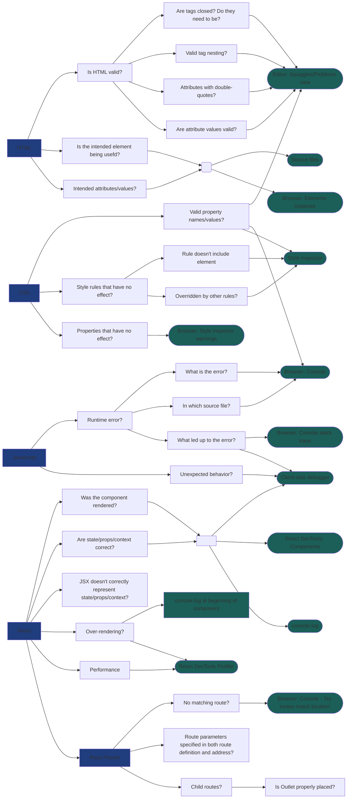
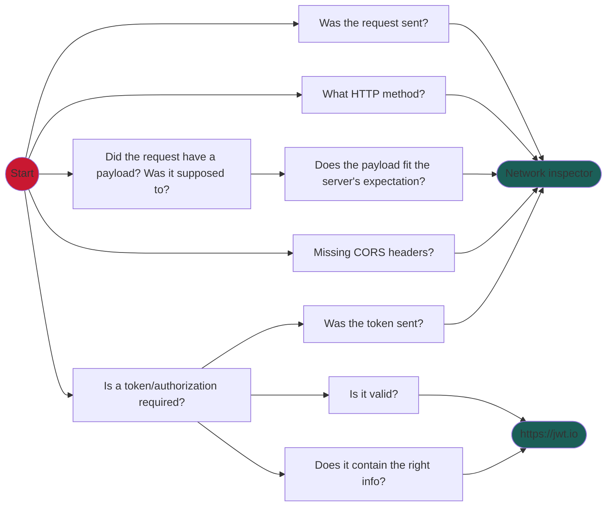
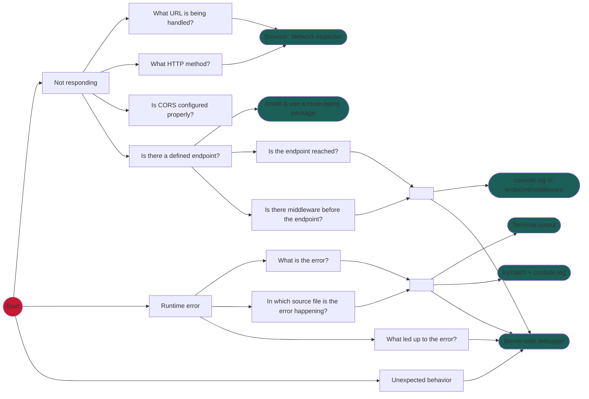
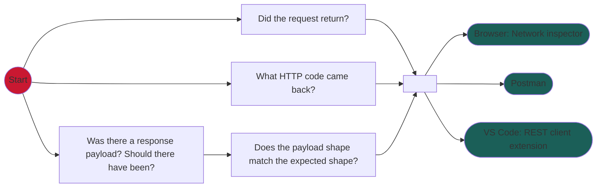

# מפת דרכים לאיתור באגים ב-Fullstack

לא ניתן לפתוח קישורים באופן ישיר, רק עם לחיצה-אמצעית, CTRL+click (או Command+click), או לחיצה-ימנית ופתיחה בטאב חדש.

## בכתיבת הקוד

## בהפעלת הקוד

### צד לקוח

### בקשה מצד לקוח לצד שרת

### צד שרת

### תגובת שרת ללקוח

