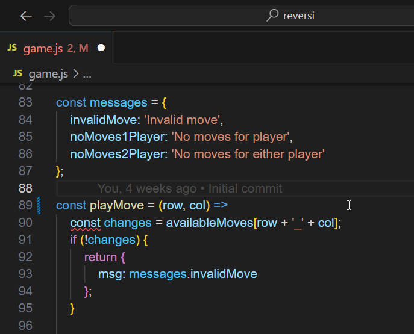
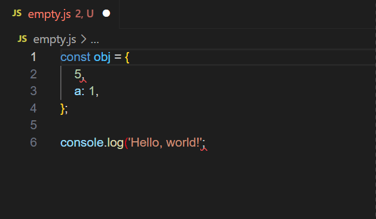
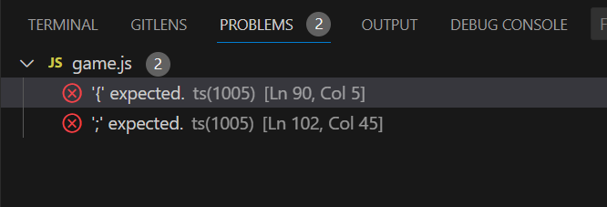
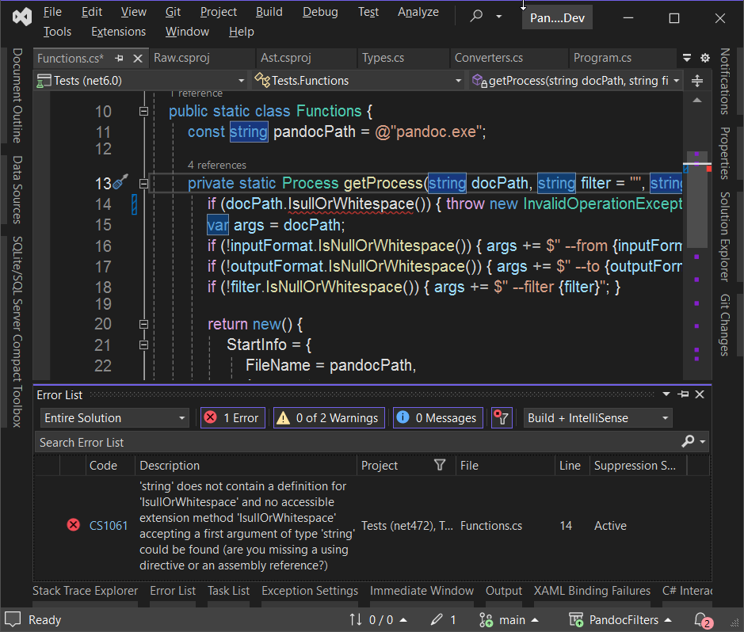
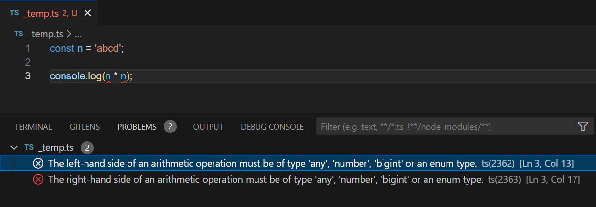

# עורך טקסט / סביבת פיתוח

עורך הטקסט הנפוץ ביותר בכלל המתכנתים ב-Fullstack הוא ה-[VS Code](https://code.visualstudio.com/). הוא מדווח על שגיאות שניתן לזהות אותם בזמן כתיבת הקוד, באמצעות קווים מקווקים בחלון העריכה:



ניתן גם לעבור משגיאה לשגיאה עם ALT+F8. ייפתח חלונית קטנה ליד כל שגיאה עם פרטי השגיאה:



תצוגת **Problems View** שאוסף את הבעיות הידועות מכל הקבצים בתיקית שורש, או לכל הפחות בקבצים הפתוחים:



ניתן לפתוח את ה-Problems View באמצעות CTRL+SHIFT+M או בחיפוש מהתפריט הראשי או מהתפריטים (**View** -> **Problems**).

בלחיצה-כפולה על הבעיה ב-**Problems View** ניתן לנווט ישר לאותה בעיה.

קיימים מנגנונים דומים בעורכי טקסט / סביבות פיותוח אחרים.

כגון ב-Visual Studio:



ו-[Eclipse](https://help.eclipse.org/latest/index.jsp?topic=%2Forg.eclipse.platform.doc.user%2Fconcepts%2Fcprbview.htm):


ו-[JetBrains Rider](https://www.jetbrains.com/help/rider/Problems_Tool_Window.html)


## שפת TypeScript

שפת JavaScript לא מזהה טיפוסים - היא לא מבחינה בין מחרוזת למספר, או מזהה צורה מסויימת של אובייקט. כך, מגלים שגיאות כאלו רק בזמן ריצת  הקוד, ולא בזמן שכותבים אותו.

```javascript
const n = 'abcd';

// אלף שורות קוד
// ...

console.log(n * n);
```

שפת TypeScript מוסיף זיהוי טיפוס למשתנים וביטויים, כך שניתן להציף שגיאות כאלו בזמן כתיבת הקוד.



ה-TypeScript עובר פעולת עיבוד הנקרא compilation, שבו מסירים את תוספות התחביר של TypeScript ונשאר רק JavaScript המוכר על ידי הדפדפן או סביבת JavaScript אחרת, כגון NodeJS.

## תכונות נוספות

עורך הטקסט / סביבת פיתוח מכיל בדרך כלל terminal מוטמע, שממנו אפשר להפעיל פקודות ב-command line.

בנוסף, קיימים גם כלים לעקוב אחרי פעילות הקוד שורה שורה לאתר בעיות - debugging.